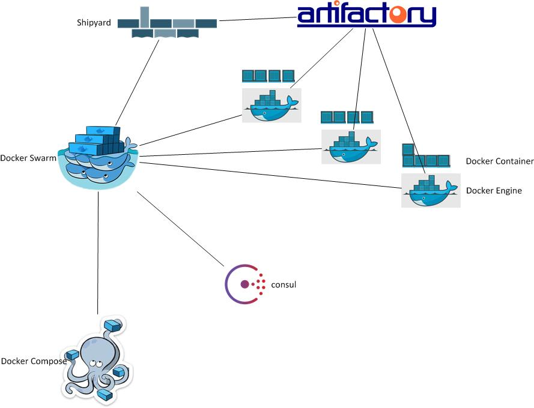

[](https://travis-ci.org/kamigerami/EcoSystem)



# EcoSystem
A Consul, Dnsmasq, Docker Swarm, Docker compose, Artifactory ecosystem simulating a real world production setup

This will bring up the following hosts all running Centos/7 with Consul master, Docker-Engine.

I created the vagrant file to be as dynamic as possible! You can basically just change a few variables and have the entire thing suit your own needs.


Please see ToDo (below). Will add a bunch of stuff continously 


````
Versions Installed in boxes right now (will always fetch latest):

CentOS 7.1 
Docker version 1.9.1, build a34a1d5
swarm version 1.0.1, build 744e3a3
gliderlabs/registrator v6
pip (7.1.2)
six (1.10.0)
setuptools (0.9.8)
docker-py (1.6.0)
consul (0.6.3)

Current machine states:

dockerhost-01.example.com  [ Docker Engine + Registrator + Swarm agent ]
dockerhost-02.example.com  [ Docker Engine + Registrator + Swarm agent ]
dockerhost-03.example.com  [ Docker Engine + Registrator + Swarm agent ]
dockerswarm-01.example.com [ Docker Engine + Registrator + Swarm manager + Shipyard UI ]
consul-01.example.com  [ Consul server + Memory, CPU, HDD checks + Docker Engine  + Registrator]
consul-02.example.com  [ Consul server + Memory, CPU, HDD checks + Docker Engine + Registrator]
consul-03.example.com  [ Consul server + Memory, CPU, HDD checks + Docker Engine + Registrator ]
```
# Requirements

````
Ansible 2.1.x
Vagrant 1.8.x
Virtualbox v.5.x
````

# Structure
Currently this is a work in progress and I will commit, rewrite the code, commit some more, change the architechture around, use some different products like Mesos for example. Nothing is set in stone just yet.

I will provide more information as this ecosystem progresses further.

````
$ tree
.
├── LICENSE
├── README.md
├── Vagrantfile
├── architecture
│   └── architecture.jpg
└── provisioning
    ├── hosts
    ├── roles
    │   ├── common
    │   │   └── tasks
    │   │       ├── main.yml
    │   │       └── userinfo.yml
    │   ├── consul
    │   │   ├── defaults
    │   │   │   └── main.yml
    │   │   ├── files
    │   │   │   ├── cpu_utilization.sh
    │   │   │   ├── hdd_utilization.sh
    │   │   │   └── mem_utilization.sh
    │   │   ├── handlers
    │   │   │   └── main.yml
    │   │   ├── tasks
    │   │   │   ├── config.yml
    │   │   │   ├── install.yml
    │   │   │   ├── main.yml
    │   │   │   └── service.yml
    │   │   └── templates
    │   │       ├── bootstrap.json
    │   │       └── consul.conf.j2
    │   ├── dnsmasq
    │   │   ├── defaults
    │   │   │   └── main.yml
    │   │   ├── tasks
    │   │   │   └── main.yml
    │   │   └── templates
    │   │       └── 10-consul.conf
    │   ├── docker
    │   │   ├── defaults
    │   │   │   └── main.yml
    │   │   ├── files
    │   │   │   └── override.conf
    │   │   ├── handlers
    │   │   │   └── main.yml
    │   │   ├── tasks
    │   │   │   ├── config.yml
    │   │   │   ├── install.yml
    │   │   │   ├── main.yml
    │   │   │   └── service.yml
    │   │   ├── templates
    │   │   │   ├── docker-main.repo.j2
    │   │   │   └── sysconfig.j2
    │   │   └── vars
    │   │       └── main.yml
    │   ├── dockerswarm
    │   │   └── tasks
    │   │       ├── agent.yml
    │   │       ├── main.yml
    │   │       └── manager.yml
    │   ├── registrator
    │   │   └── tasks
    │   │       └── main.yml
    │   └── shipyard
    │       └── tasks
    │           ├── controller.yml
    │           ├── datastore.yml
    │           └── main.yml
    └── site.yml

28 directories, 39 files

````
# ToDo

Add Compose, Artifactory.

Update to use Docker Network overlay

Change to high availability Swarm manager with replicas and fail-over

# How to 

```
vagrant up 
```
Go to :  http://192.168.35.101 to access your Consul UI.

Go to :  http://192.168.35.124:8080 to access your ShipYard UI (username/pw = admin/shipyard)

