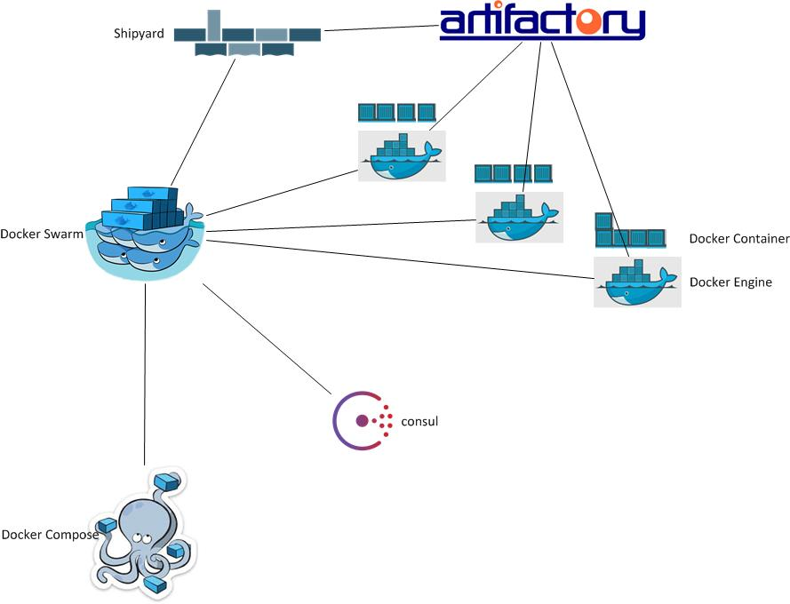

[](https://travis-ci.org/kamigerami/EcoSystem)



# Docker Swarm (1.10) + Consul
A Consul, Dnsmasq, Docker Swarm, Docker compose, Artifactory ecosystem simulating a real world production setup

This will bring up the following hosts all running Centos/7 with Consul master, Docker-Engine.

I created the vagrant file to be as dynamic as possible! You can basically just change a few variables and have the entire thing suit your own needs.


Please see ToDo (below). Will add a bunch of stuff continously 


````
Versions Installed in boxes right now (will always fetch latest):

CentOS 7.1 
Docker version 1.12.2, build bb80604
docker-compose version 1.8.1, build 878cff1
~~swarm version 1.1.3, build 7e9c6bd~~
gliderlabs/registrator v6
pip (8.1.1)
six (1.10.0)
setuptools (0.9.8)
docker-py (1.10.4)
consul (0.6.4)


Current machine states:

consul-01.example.com  [ Consul server + Memory, CPU, HDD checks + Docker Engine  + Registrator + Docker compose ]
consul-02.example.com  [ Consul server + Memory, CPU, HDD checks + Docker Engine + Registrator + Docker compose ]
consul-03.example.com  [ Consul server + Memory, CPU, HDD checks + Docker Engine + Registrator + Docker compose ]
Dockerswarm-01.example.com [ Docker Engine + Registrator + Swarm manager + Shipyard UI + Docker compose ]
Dockerswarm-02.example.com [ Docker Engine + Registrator + Swarm manager replication + Shipyard UI + Docker compose ]
swarmnode-01.example.com  [ Docker Engine + Registrator + Swarm agent + Docker Compose ]
swarmnode-02.example.com  [ Docker Engine + Registrator + Swarm agent + Docker Compose ]
swarmnode-03.example.com  [ Docker Engine + Registrator + Swarm agent + Docker Compose ]
```
# Requirements

````
Ansible 2.1.x
Vagrant 1.8.x
Virtualbox v.5.x
````

# Structure
Currently this is a work in progress and I will commit, rewrite the code, commit some more, change the architechture around, use some different products like Mesos or etcd for service discovery and kubernetes instead of swarm but these will be done in different branches for example. Nothing is set in stone just yet.

I will provide more information as this ecosystem progresses further.

````
$ tree
.
├── LICENSE
├── README.md
├── Vagrantfile
├── architecture
│   └── architecture.jpg
└── provisioning
    ├── hosts
    ├── roles
    │   ├── common
    │   │   └── tasks
    │   │       └── main.yml
    │   ├── consul
    │   │   ├── defaults
    │   │   │   └── main.yml
    │   │   ├── files
    │   │   │   ├── cpu_utilization.sh
    │   │   │   ├── hdd_utilization.sh
    │   │   │   └── mem_utilization.sh
    │   │   ├── handlers
    │   │   │   └── main.yml
    │   │   ├── tasks
    │   │   │   ├── config.yml
    │   │   │   ├── install.yml
    │   │   │   ├── main.yml
    │   │   │   └── service.yml
    │   │   └── templates
    │   │       ├── bootstrap.json
    │   │       └── consul.conf.j2
    │   ├── dnsmasq
    │   │   ├── defaults
    │   │   │   └── main.yml
    │   │   ├── tasks
    │   │   │   └── main.yml
    │   │   └── templates
    │   │       └── 10-consul.conf
    │   ├── docker
    │   │   ├── defaults
    │   │   │   └── main.yml
    │   │   ├── files
    │   │   │   └── override.conf
    │   │   ├── handlers
    │   │   │   └── main.yml
    │   │   ├── tasks
    │   │   │   ├── config.yml
    │   │   │   ├── install.yml
    │   │   │   ├── main.yml
    │   │   │   └── service.yml
    │   │   ├── templates
    │   │   │   ├── docker-main.repo.j2
    │   │   │   └── sysconfig.j2
    │   │   └── vars
    │   │       └── main.yml
    │   ├── dockercompose
    │   │   └── tasks
    │   │       ├── install.yml
    │   │       └── main.yml
    │   ├── dockerswarm
    │   │   └── tasks
    │   │       ├── agent.yml
    │   │       ├── main.yml
    │   │       ├── manager.yml
    │   │       └── replica.yml
    │   ├── final
    │   │   └── tasks
    │   │       └── main.yml
    │   ├── registrator
    │   │   └── tasks
    │   │       └── main.yml
    │   └── shipyard
    │       └── tasks
    │           ├── controller.yml
    │           ├── datastore.yml
    │           └── main.yml
    └── site.yml

32 directories, 42 files

````
# ToDo

Update to use docker overlay network #19

Add TLS for communication #24

Add registry or artifactory as a Docker registry #28

Add support for container metrics / Data / monitoring / alerts #29

# How to 

```
vagrant up 
```
Go to :  http://192.168.35.101 to access your Consul UI.

Go to :  http://192.168.35.124:8080 to access your ShipYard UI (username/pw = admin/shipyard)

